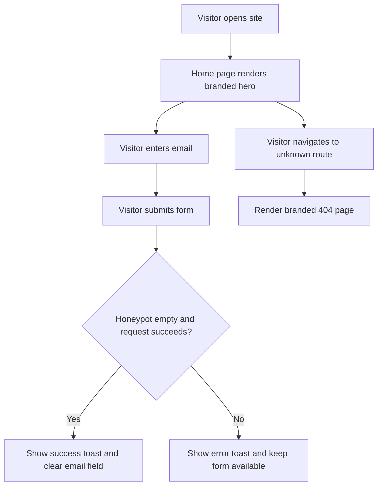

## 1. Product Overview
Rebuild the existing Jays for Jeans coming-soon landing page into a production-ready Next.js application without changing the visual identity, user flow, or lead-capture behavior.
- Main purpose: preserve the branded launch page, email signup flow, motion design, and logo treatment while moving to a deployable Vercel-friendly stack.
- Business value: create a maintainable Next.js codebase that can ship immediately and support future expansion beyond the current single-page launch experience.

## 2. Core Features

### 2.1 Feature Module
1. **Home page**: branded hero, animated logo, decorative floating icons, signup form, social icons, footer.
2. **Not found page**: lightweight branded fallback for unknown routes.

### 2.2 Page Details
| Page Name | Module Name | Feature description |
|-----------|-------------|---------------------|
| Home page | Background canvas | Full-screen denim gradient backdrop with preserved color tokens and atmospheric depth |
| Home page | Brand logo | Uses the existing Jays for Jeans logo asset with animated entrance and drop-shadow glow |
| Home page | Hero copy | Preserves the current coming-soon message, tone, typography hierarchy, and spacing |
| Home page | Decorative motion | Floating shirt icons loop subtly in the viewport without blocking interaction |
| Home page | Signup form | Email field, CTA button, honeypot field, loading state, success/error feedback, same payload contract |
| Home page | Social icon row | Keeps the current icon treatment and hover behavior, ready for link wiring |
| Home page | Footer | Displays the branded copyright line at the viewport bottom |
| Not found page | Error handling | Simple fallback view aligned to the Next.js routing model |

## 3. Core Process
Visitors land on the launch page, absorb the brand presentation, submit their email through the preserved external form endpoint, and receive immediate success or failure feedback without leaving the page. Unknown routes fall back to a lightweight branded 404 state.

## 4. User Interface Design
### 4.1 Design Style
- Primary colors: warm brand yellow for CTAs and highlights, deep denim blues for the background, vivid red for contrast accents and brand foreground.
- Button style: rounded, high-contrast CTA with soft glow and tactile hover feedback.
- Fonts and sizes: playful display headline paired with friendly rounded body text; maintain the current hierarchy and approachable tone.
- Layout style: centered single-column launch page with generous breathing room and animated decorative elements placed around the viewport.
- Icon style suggestions: rounded lucide icons and shirt motifs with soft opacity for motion layers.

### 4.2 Page Design Overview
| Page Name | Module Name | UI Elements |
|-----------|-------------|-------------|
| Home page | Hero section | Centered composition, logo-first visual order, bold playful headline, subtle entrance animation |
| Home page | Signup form | Leading email icon, rounded input, bold CTA, compact desktop row and stacked mobile layout |
| Home page | Motion layer | Floating shirt icons, staggered fades, spring-based logo reveal, restrained hover scaling |
| Home page | Footer and socials | Low-noise footer text, circular icon buttons, balanced spacing below the form |
| Not found page | Error state | Minimal branded fallback with clear recovery path |

### 4.3 Responsiveness
Desktop-first implementation with mobile adaptation. The layout stays centered on large screens, stacks the form controls on small screens, keeps animation lightweight, and preserves touch-friendly button sizing.
