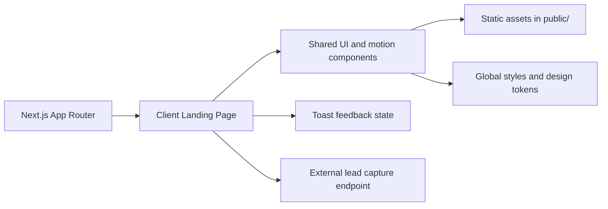
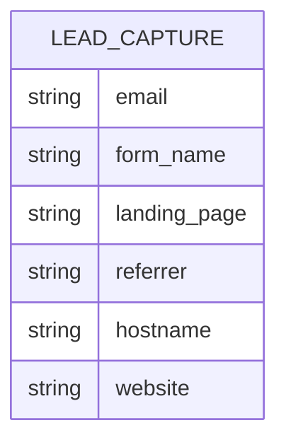

## 1. Architecture Design


## 2. Technology Description
- Frontend: Next.js 15 + React 18 + TypeScript + Tailwind CSS
- Motion: Framer Motion for preserved entrance and floating animations
- UI primitives: lightweight reusable components migrated only where the landing page needs them
- Notifications: local client-side toast system for submit feedback
- Deployment: Vercel with static assets served from `public/`

## 3. Route Definitions
| Route | Purpose |
|-------|---------|
| / | Coming-soon landing page with preserved design and lead capture |
| /not-found | Branded not-found UI surfaced through the App Router fallback |

## 4. API Definitions
### 4.1 External Lead Capture Contract
The application keeps the existing third-party form connector and submits through a same-origin Next.js route that forwards the request server-side.

```ts
type LeadCaptureRequest = {
  email: string;
  form_name: "coming_soon_signup";
  landing_page?: string;
  referrer?: string;
  hostname?: string;
  website?: string;
};

type LeadCaptureResponse =
  | { ok: true }
  | { ok: false; error?: string };
```

### 4.2 Submission Rules
- Public endpoint: `/api/lead`
- Upstream endpoint: `https://admin.betterranking.co.uk/sender/api/f/bs_yldwv8pqxdg3nx9kgc8iq3y0`
- Method: `POST`
- Headers: `Content-Type: application/json`, `Accept: application/json`
- Anti-spam: preserve hidden `website` honeypot field and send it unchanged
- Runtime: the client can submit with fetch for inline feedback, while the form action also supports a non-JavaScript fallback through the same-origin route

## 5. Server Architecture Diagram
The app uses a lightweight Next.js route handler to forward lead submissions to the existing external form service without exposing deployment-time coupling in the client.

## 6. Data Model
### 6.1 Data Model Definition


### 6.2 Data Definition Language
No internal database is required for the current release.

Planned schema impact:
- None in application storage, because the rebuild preserves the external submission contract and does not add an internal database.
- If server-side form handling is added later, mirror the `LeadCaptureRequest` fields in a single leads table and index `email` plus `created_at`.
